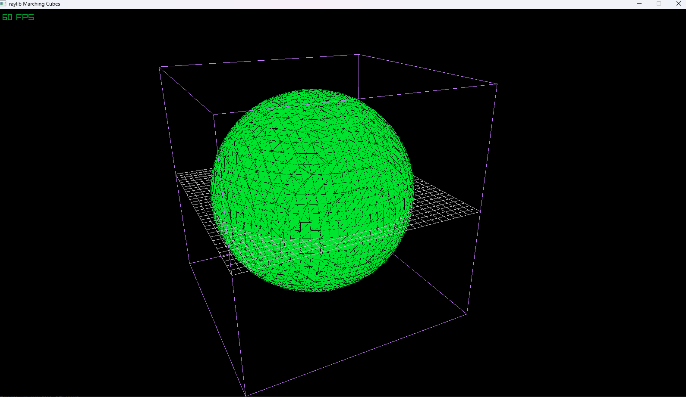

<!-- GENERAL GAME INFO -->
 

  <h2 align="center">Marching Cubes</h2>

  

    Marching cubes is an algorithm for extracting a polygonal mesh of an isosurface from a three-dimensional discrete scalar field (the elements of which are sometimes called voxels).
     
    <strong>Marching Cubes </strong>
    <a href="https://en.wikipedia.org/wiki/Marching_cubes"><strong>General info »</strong></a>
    <a href="https://www.youtube.com/watch?v=M3iI2l0ltbE"><strong>Youtube video as reference »</strong></a>
  

 

## My version

This section gives a clear and detailed overview of what I did for this project specifically.

### The minimum I will most certainly develop:
the basic algorithm to generate meshes based on implicit functions.
using threading to load it into chunks 

  

<h1>Sources</h1>

The following links are the sources used to finish this research:

<a href="<link>https://www.google.com/url?sa=t&source=web&rct=j&opi=89978449&url=http://fab.cba.mit.edu/classes/S62.12/docs/Lorensen_marching_cubes.pdf&ved=2ahUKEwjJk6Dm0dmUAxWgVKQEHcr-BQoQFnoECCAQAQ&usg=AOvVaw32N-aUb02hc8Gh1MaGhVXV">Document on Marching cubes</a>

<a href="<link>https://paulbourke.net/geometry/polygonise/"> Code walkthrough in C & Table</a>

<a href="<link>https://www.youtube.com/watch?v=M3iI2l0ltbE"> Explanation in Unity Youtube video</a>

<a href="<link>https://www.youtube.com/watch?v=KvwVYJY_IZ4&t=57s"> More indepth video on Marching cubes</a>

