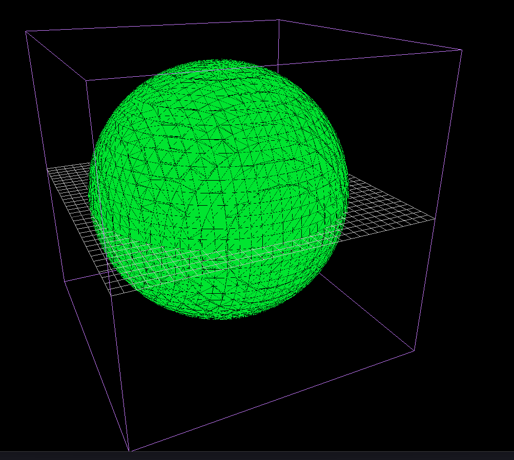
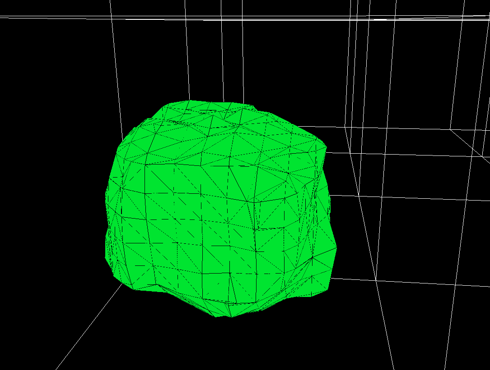
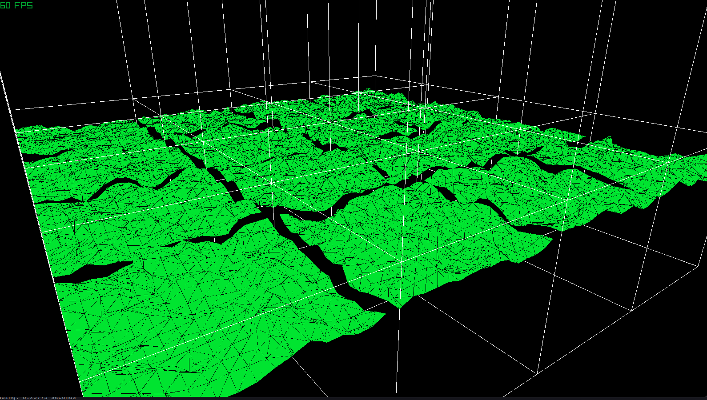
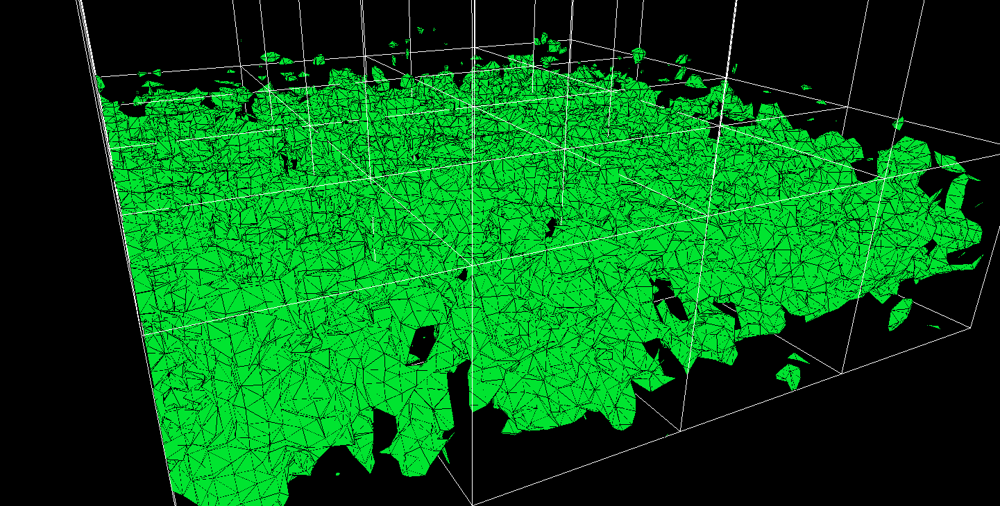

<a name="readme-top"></a>

# Marching Cubes

An implementation of the marching cubes algorithm in C++ using Raylib, with multithreaded chunk generation.


<hr>


## What is marching cubes?

Marching cubes is an algorithm that turns a 3D scalar field into a mesh.
Instead of placing geometry by hand,
you define a function that returns a number at every point in space. Negative means "inside the surface",
positive means "outside". The algorithm basically marches through every cube-shaped cell in a voxel grid and
figures out which edges the surface crosses, and outputs triangles.

The result is a mesh from any implicit function, without ever placing anything yourself.
 
<hr>


## How it works, step by step

### 1. The scalar field and density function

Every point in 3D space has a density value. The surface sits exactly where density = 0. <0 = inside, >0 = outside.

In `Utils`, the density function is:

```cpp
float Utils::Density(float x, float y, float z)
{
    constexpr float groundLevel{ 5.f };
    float scalar{ y - groundLevel };
    float noise = noiseMap.GetNoise(x, y, z);
    scalar -= noise * 2.0f;
    return scalar;
}
```


`y - groundLevel`  on its own would give a perfectly flat plane.
Adding noise and subtracting it from the scalar creates hills and valleys.
The terrain shape is entirely decided by where this function equals zero.



<hr>

### 2. Sampling the grid

`LoadChunks` fills a voxel grid by calling `Density` at every corner.
Each chunk has a position in chunk-space:

```cpp
float worldX = static_cast<float>(x) + ChunkPos.x * static_cast<float>(total - 1) - static_cast<float>(half);
```

The `total - 1` makes it so that each chunk seamlessly connects, so that there are no cracks between them.



<hr>


### 3. The cube index (0–255)

For each cell in the grid, `DrawChunks` reads the density at all 8 corners and computes a cube index:

```cpp
int Utils::CubeIndex(float *ds[])
{
    int cubeIndex{ 0 };
    for (size_t i = 0; i < 8; i++)
        if (*ds[i] < 0.f)
            cubeIndex |= (1 << i);
    return cubeIndex;
}
```

Each corner is one bit. If its density is negative (inside), its bit is set.
With 8 corners there are 2⁸ = 256 possible combinations,
covering every way the surface can pass through a cube.
Index 0 means all corners are outside (no surface).
Index 255 means all corners are inside (no surface).
Everything in between produces some triangle.

<hr>

### 4. Edge table lookup

Not every edge is crossed by the surface.
The precomputed `edgeTable[256]` is a bitmask. Each of its 12 bits corresponds to one edge of the cube.
If a bit is set, the surface crosses that edge and a vertex needs to be placed there:

```cpp
int edges = edgeTable[cubeIndex];
if (edges == 0) continue;
```

This skips any cell where the surface doesn't pass through at all.

<hr>

### 5. Vertex interpolation

Snapping every vertex to the midpoint of its edge would create a blocky,
Minecraft like result.
Instead, by using interpolation based on their densities:

```cpp
float t{ (0.f - valA) / (valB - valA) };
vertexList[i] = Vector3Lerp(cornersCell[a], cornersCell[b], t);
```
you can achieve a smoother surface
<hr>

### 6. Triangle table → triangle mesh

`triTable[cubeIndex]` is a list of edge indices,
that describes which vertices to connect into triangles.
There are 256 covering every case.
```cpp
for (int i = 0; triTable[cubeIndex][i] != -1; i += 3)
{
    Vector3 v0 = vertexList[triTable[cubeIndex][i]];
    Vector3 v1 = vertexList[triTable[cubeIndex][i + 1]];
    Vector3 v2 = vertexList[triTable[cubeIndex][i + 2]];
    ...
}
```

<hr>

### 7. Face normals

Normals are computed per triangle using the cross product of two edges and then stored per vertex:

```cpp
Vector3 n =
    Vector3Normalize(
      Vector3CrossProduct(
        Vector3Subtract(v1, v0),
        Vector3Subtract(v2, v0)
      ));
```

<hr>

## Multithreaded chunk generation

The voxel grid for each chunk is filled in parallel.
`LoadChunks` is split across Z slices, one thread per hardware core:

```cpp
for (int i = 0; i < nThreads; i++)
{
    int zStart{ i * chunkSize };
    int zEnd{ zStart + chunkSize };
    threads.emplace_back(Utils::LoadChunks, zStart, zEnd, m_Resolution, m_Positions[c], std::ref(m_Chunks[c]));
}
```

Mesh generation `DrawChunks`
is also parallelized. Each chunk runs on its own `thread`,
writing into its own `ChunkMeshData` to avoid data races.
Results are pushed to the GPU after all threads are finished. That's how you get the following result :]!

<hr>





<hr>

<div>
  <h2 >Sources</h2>
  <ul >
    <li><a href="https://paulbourke.net/geometry/polygonise/">Paul Bourke — Polygonising a scalar field</a> — C walkthrough + complete lookup tables</li>
    <li><a href="https://fab.cba.mit.edu/classes/S62.12/docs/Lorensen_marching_cubes.pdf">Lorensen & Cline (1987) — Marching Cubes</a> — original SIGGRAPH paper</li>
    <li><a href="https://www.youtube.com/watch?v=M3iI2l0ltbE">YouTube — visual walkthrough</a> — step-by-step visual reference</li>
  </ul>
</div>


